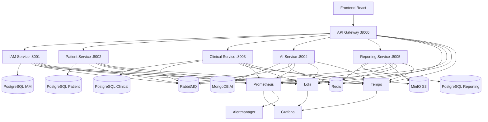
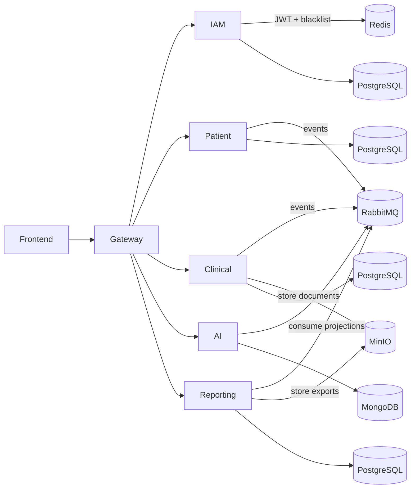

# Representação da Arquitetura de Software

Este documento consolida a arquitetura utilizada no PROMPTUARIO Backend com base na implementação real do workspace.

---

## 1. Visão Geral

A solução adota uma arquitetura distribuída orientada a serviços, com separação por contexto de negócio e comunicação síncrona e assíncrona entre componentes.

### Características principais

- Microservices com responsabilidade delimitada por domínio
- API Gateway como ponto único de entrada
- JWT para autenticação e autorização
- Database per service
- Comunicação orientada a eventos com RabbitMQ
- Processamento assíncrono para análises e relatórios
- Observabilidade distribuída com métricas, logs e tracing
- Infraestrutura containerizada com Docker Compose

---

## 2. Representação Global

---

## 3. Estilo Arquitetural

| Camada | Papel |
|--------|------|
| Apresentação | Frontend React consumindo o Gateway |
| Borda | API Gateway com autenticação, rate limiting e roteamento |
| Domínio | Microserviços por contexto funcional |
| Persistência | Banco dedicado por serviço |
| Mensageria | RabbitMQ para eventos assíncronos |
| Processamento | Celery e workers para tarefas demoradas |
| Observabilidade | Prometheus, Grafana, Loki, Tempo e Alertmanager |

---

## 4. Mapa de Serviços

| Serviço | Porta | Responsabilidade | Banco |
|--------|-------|------------------|-------|
| IAM | 8001 | Autenticação, usuários, roles e blacklist JWT | PostgreSQL |
| Patient | 8002 | Pacientes, dados demográficos e histórico básico | PostgreSQL |
| Clinical | 8003 | Agendamentos, prontuários, prescrições e auditoria | PostgreSQL |
| AI | 8004 | Análises clínicas assíncronas e integrações de IA | MongoDB |
| Reporting | 8005 | Relatórios, projeções e exportações | PostgreSQL |
| Gateway | 8000 | Entrada única, auth, proxy e agregação de health | Stateless |

---

## 5. Fluxo de Comunicação

### Leitura do fluxo

- O frontend nunca acessa os serviços internos diretamente; tudo passa pelo Gateway.
- O Gateway valida o JWT e encaminha a requisição para o serviço correto.
- Serviços de domínio persistem dados em bancos próprios.
- Eventos de negócio seguem para o RabbitMQ para reduzir acoplamento.
- AI e Reporting executam tarefas assíncronas quando a operação não deve bloquear a requisição principal.

---

## 6. Padrões de Projeto Aplicados

- API Gateway Pattern
- Database per Service
- Event-Driven Architecture
- CQRS-inspired projections para relatórios
- Clean Architecture nos serviços de domínio
- Repository Pattern para persistência
- Async task processing para AI e Reporting
- Health checks por serviço e agregação no Gateway

---

## 7. Dependências Entre Serviços

| Origem | Destino | Motivo |
|--------|---------|--------|
| IAM | Gateway | Validação de tokens e controle de acesso |
| Patient | Clinical | Dados do paciente usados em atendimento |
| Clinical | AI | Solicitação de análise clínica |
| Clinical | Reporting | Geração de projeções e relatórios |
| AI | Reporting | Resultados analíticos reaproveitados em relatórios |
| Todos os serviços | Observabilidade | Métricas, logs e tracing |

---

## 8. Infraestrutura de Suporte

| Componente | Função |
|------------|--------|
| PostgreSQL 15 | Persistência relacional por serviço |
| MongoDB 7 | Persistência documental do AI Service |
| Redis 7 | Cache, blacklist JWT, rate limiting e broker auxiliar |
| RabbitMQ 3.13 | Mensageria assíncrona entre serviços |
| MinIO | Armazenamento compatível com S3 |
| Prometheus | Coleta de métricas |
| Grafana | Dashboards e visualização |
| Loki | Centralização de logs |
| Tempo | Tracing distribuído |
| Alertmanager | Alertas operacionais |

---

## 9. Conclusão

A arquitetura combina serviços independentes, orquestração por container, comunicação assíncrona e observabilidade distribuída. O resultado é um desenho escalável, com menor acoplamento entre domínios e melhor capacidade de evolução por serviço.
