# DIAGRAMA DE CASOS DE USO

## PROMPTUARIO Backend

Este documento apresenta a visao funcional do sistema em formato de casos de uso, cobrindo os principais atores, interacoes e responsabilidades dos servicos distribuidos.

> Observacao: o Mermaid nao oferece, de forma nativa, uma notacao UML de use case no conjunto de diagramas suportados neste projeto. Por isso, o caso de uso foi representado em um fluxo visual equivalente, mantendo atores, limites do sistema e interacoes principais.

---

## 1. Atores

- **Paciente**: acessa o portal, consulta dados e acompanha seu atendimento.
- **Medico**: realiza consultas, registra prontuarios, gera prescricoes e solicita analises.
- **Atendente**: apoia o cadastro, o agendamento e a gestao operacional.
- **Administrador**: administra usuarios, acessos, parametros e auditoria.
- **Operador**: acompanha saude, logs, metricas e disponibilidade da plataforma.

---

## 2. Escopo Funcional

O limite do sistema engloba:
- Gateway de entrada e validacao de autenticacao.
- Servico IAM para login, refresh, logout e gestao de usuarios.
- Servico de Pacientes para cadastro e manutencao de dados clinicos e cadastrais.
- Servico Clinico para agenda, consultas, prontuarios, prescricoes e exames.
- Servico de IA para analises assicronas.
- Servico de Relatorios para exportacoes e consultas gerenciais.
- Camada de observabilidade para logs, metricas, traces e alertas.

---

## 3. Diagrama de Casos de Uso

```mermaid
flowchart LR
    classDef actor fill:#1f2937,stroke:#111827,color:#ffffff,stroke-width:1px;
    classDef usecase fill:#f8fafc,stroke:#334155,color:#0f172a,stroke-width:1px,rx:18,ry:18;
    classDef system fill:#eff6ff,stroke:#2563eb,color:#1e3a8a,stroke-width:1.5px;

    subgraph Atores
        PAC[Paciente]:::actor
        MED[Medico]:::actor
        ATT[Atendente]:::actor
        ADM[Administrador]:::actor
        OPE[Operador]:::actor
    end

    subgraph Sistema[PROMPTUARIO Backend]
        GATEWAY[Gateway API]:::system

        AUTH((Autenticar usuario)):::usecase
        REFRESH((Renovar token)):::usecase
        LOGOUT((Encerrar sessao)):::usecase
        USER_MGMT((Gerenciar usuarios)):::usecase

        PATIENT_MGMT((Gerenciar pacientes)):::usecase
        ALLERGY((Registrar alergias)):::usecase
        MEDS((Registrar medicacoes continuas)):::usecase
        VACCINE((Registrar vacinas)):::usecase

        SCHEDULE((Gerenciar agenda)):::usecase
        APPOINT((Agendar consulta)):::usecase
        CANCEL((Cancelar consulta)):::usecase
        RECORD((Criar e atualizar prontuario)):::usecase
        HISTORY((Consultar historico clinico)):::usecase
        PRESC((Gerar prescricao)):::usecase
        EXAM((Solicitar exame)):::usecase

        AI((Solicitar analise por IA)):::usecase
        AI_STATUS((Acompanhar status da analise)):::usecase

        REPORT((Gerar relatorio)):::usecase
        DOWNLOAD((Baixar relatorio)):::usecase
        METRICS((Consultar metricas e logs)):::usecase
        HEALTH((Consultar saude dos servicos)):::usecase
    end

    PAC --> AUTH
    PAC --> APPOINT
    PAC --> HISTORY
    PAC --> AI_STATUS
    PAC --> DOWNLOAD

    MED --> AUTH
    MED --> USER_MGMT
    MED --> PATIENT_MGMT
    MED --> ALLERGY
    MED --> MEDS
    MED --> VACCINE
    MED --> SCHEDULE
    MED --> APPOINT
    MED --> CANCEL
    MED --> RECORD
    MED --> HISTORY
    MED --> PRESC
    MED --> EXAM
    MED --> AI
    MED --> AI_STATUS
    MED --> REPORT
    MED --> DOWNLOAD

    ATT --> AUTH
    ATT --> PATIENT_MGMT
    ATT --> APPOINT
    ATT --> CANCEL
    ATT --> REPORT

    ADM --> AUTH
    ADM --> REFRESH
    ADM --> LOGOUT
    ADM --> USER_MGMT
    ADM --> PATIENT_MGMT
    ADM --> SCHEDULE
    ADM --> RECORD
    ADM --> REPORT
    ADM --> METRICS
    ADM --> HEALTH

    OPE --> HEALTH
    OPE --> METRICS

    GATEWAY -.-> AUTH
    GATEWAY -.-> REFRESH
    GATEWAY -.-> LOGOUT
    GATEWAY -.-> USER_MGMT
    GATEWAY -.-> PATIENT_MGMT
    GATEWAY -.-> SCHEDULE
    GATEWAY -.-> RECORD
    GATEWAY -.-> AI
    GATEWAY -.-> REPORT
    GATEWAY -.-> HEALTH

    AUTH --> REFRESH
    AUTH --> LOGOUT
    PATIENT_MGMT --> ALLERGY
    PATIENT_MGMT --> MEDS
    PATIENT_MGMT --> VACCINE
    SCHEDULE --> APPOINT
    SCHEDULE --> CANCEL
    RECORD --> HISTORY
    RECORD --> PRESC
    RECORD --> EXAM
    AI --> AI_STATUS
    REPORT --> DOWNLOAD
    HEALTH --> METRICS
```

---

## 4. Regras de Negocio Representadas

1. Todo acesso autenticado passa pelo Gateway antes de chegar aos servicos.
2. O Administrador possui permissao para gestao global de usuarios e saude operacional.
3. O Medico pode executar as atividades clinicas centrais do sistema.
4. O Atendente atua como apoio operacional em cadastro e agendamento.
5. O Paciente acessa apenas dados e operacoes permitidas sobre o proprio contexto.
6. As analises de IA e os relatorios sao processados de forma assincrona quando aplicavel.

---

## 5. Mapeamento Para os Principais Modulos

- **IAM**: autenticar usuario, renovar token, encerrar sessao, gerenciar usuarios.
- **Patient**: gerenciar pacientes, alergias, vacinas e medicacoes continuas.
- **Clinical**: agendar consultas, cancelar consultas, criar prontuarios, historico, prescricoes e exames.
- **AI**: solicitar analises e consultar status/resultados.
- **Reporting**: gerar e baixar relatorios.
- **Gateway e Observabilidade**: validacao de acesso, saude, metricas e logs.

---

## 6. Critérios de Leitura do Diagrama

- As ligacoes entre atores e casos de uso representam responsabilidade funcional, nao implementacao tecnica.
- Os casos de uso agregam varias operacoes internas e endpoints da API.
- O diagrama e complementar aos documentos de endpoints, arquitetura e modelo logico.

---

## 7. Conclusao

O diagrama consolida a visao de negocio do PROMPTUARIO Backend e mostra como os perfis de usuario interagem com os modulos principais do sistema distribuido.