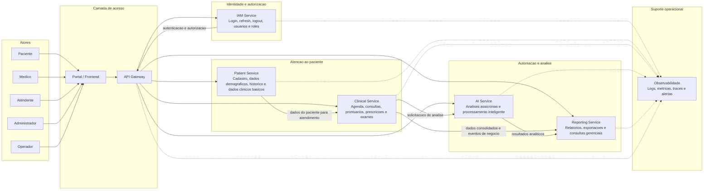

# Visao funcional do sistema

Este diagrama consolida a visao funcional do PROMPTUARIO Backend a partir dos atores de negocio, dos modulos de dominio e dos fluxos principais de uso.

## Leitura da visao

- Os atores acessam o sistema pelo portal, que centraliza as interacoes com o Gateway.
- O Gateway distribui as requisicoes para os servicos funcionais adequados.
- O IAM controla identidade, autenticacao e autorizacao.
- O Patient Service organiza o cadastro e o contexto basico do paciente.
- O Clinical Service concentra o fluxo assistencial principal, incluindo agenda, prontuario, prescricao e exames.
- O AI Service executa analises assincronas quando ha processamento adicional.
- O Reporting Service consolida informacoes para relatorios e exportacoes.
- A observabilidade acompanha toda a operacao da plataforma.

## Relacao com a documentacao existente

Este diagrama complementa o documento de [casos de uso](DIAGRAMA_DE_CASOS_DE_USO.md) e a [arquitetura de software](ARQUITETURA_DE_SOFTWARE.md), mantendo a mesma divisao por dominios do sistema.